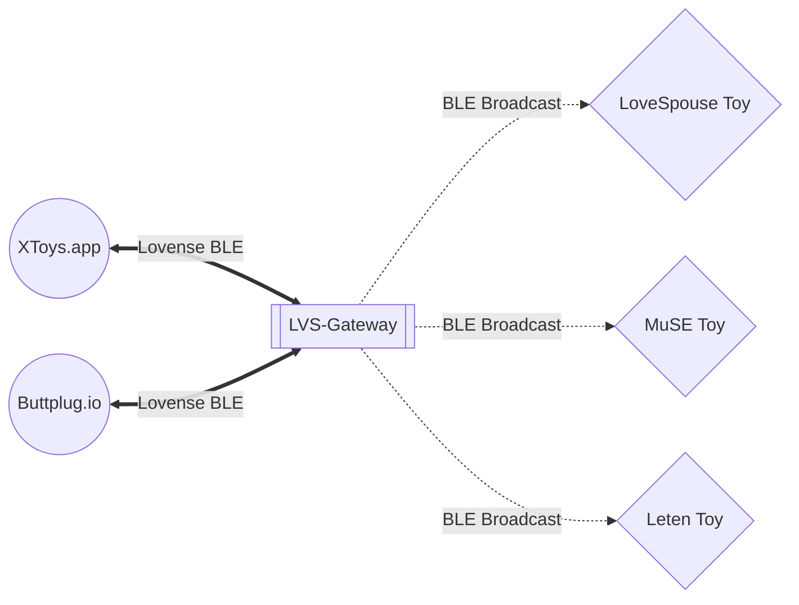

# LoveSpouse-ESP32-Gateway

ESP32/CYD firmware that translates Lovense BLE protocol to control MuSE, LoveSpouse, and Leten toys. Features a graphical interface for CYD (Cheap Yellow Display) devices.

## ✨ Features

- 🎮 **Universal Compatibility**: Works with XToys.app, buttplug.io, and any Lovense-compatible app
- 📱 **Graphical Interface**: Real-time intensity display and touch controls on CYD devices
- 🔄 **Multi-Device Support**: Control multiple toys simultaneously
- 🌐 **Web Installer**: Flash firmware directly from your browser (Chrome/Edge)
- 🔧 **Easy Setup**: No coding required, just flash and use

## 🚀 Quick Start

### Option 1: Web Installer (Recommended)

1. Visit the [Web Installer](https://n0rule.github.io/LoveSpouse-ESP32-Gateway/)
2. Connect your ESP32/CYD via USB
3. Click "Install LoveSpouse-ESP32-Gateway"
4. Follow the on-screen instructions

### Option 2: Manual Build

```bash
# Clone the repository
git clone https://github.com/n0rule/LoveSpouse-ESP32-Gateway.git
cd LoveSpouse-ESP32-Gateway

# Build with PlatformIO
platformio run

# Upload to your device
platformio run --target upload
```

## 📱 Supported Hardware

- **ESP32** (standard development boards)
- **ESP32-S3** (newer generation)
- **CYD** (Cheap Yellow Display) - ESP32 with 320x240 TFT touchscreen

## 🎯 Usage

1. **Power on** your ESP32/CYD device
2. **Connect** to the Bluetooth device named "LVS-Gateway01" from your control app
3. **Place** the ESP32 near your toy (within BLE range)
4. **Control** your toy through XToys.app, buttplug.io, or any Lovense-compatible app

### CYD Display Features

- Real-time intensity gauge (0-20 scale)
- Connection status indicator
- Touch screen to cycle brightness (0%, 50%, 75%, 100%)

## 🔌 Connectivity



## ❓ FAQ

**Q: Does this support XToys.app?**  
A: Yes! Just connect as a Lovense device via Bluetooth.

**Q: Does this support buttplug.io?**  
A: Yes, fully tested and working.

**Q: Can I control multiple devices at once?**  
A: Yes, all compatible toys within BLE range will receive the same commands.

**Q: How do I know if it's working?**  
A: If your toy vibrates when you send commands, it's working. The CYD display also shows real-time intensity.

**Q: Do you recommend buying MuSE/LoveSpouse devices?**  
A: Not really. Check [iostindex.com](https://iostindex.com) for better alternatives. If you want budget options, consider [Folove brand](https://iostindex.com/?filter0Brand=Folove) with better BLE connectivity.

**Q: What's the difference from the original LVS-Gateway?**  
A: This fork adds CYD display support with graphical interface, improved web installer, and various bug fixes.

## 🛠️ Development

### Building Locally

```bash
# Install PlatformIO
pip install platformio

# Build for ESP32
platformio run -e esp32dev

# Build for ESP32-S3
platformio run -e esp32s3

# Generate web installer files
./generate_merge_firmware_command.py esp32dev esp32s3 | bash
./generate_esp_web_tools.py
```

### Project Structure

```
├── src/
│   ├── main.cpp              # Main application with display code
│   ├── bluetooth_service.*   # BLE initialization
│   ├── lovense.*            # Lovense protocol implementation
│   └── muse.*               # MuSE/LoveSpouse protocol
├── web/
│   ├── index.html           # Web installer UI
│   └── firmware/            # Generated firmware binaries
├── platformio.ini           # Build configuration
└── generate_*.py            # Build automation scripts
```

## 🙏 Credits

- Forked from [WanhedaNC/lvs-gateway](https://github.com/WanhedaNC/lvs-gateway)
- Original concept and protocol implementation
- CYD display support and UI improvements by n0rule

## 📄 License

This project inherits the license from the original LVS-Gateway project.

## ⚠️ Disclaimer

This project is for educational purposes. Use responsibly and ensure compliance with local regulations.
